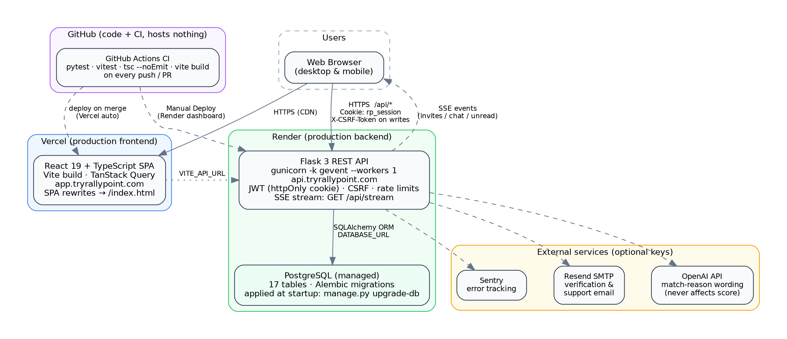
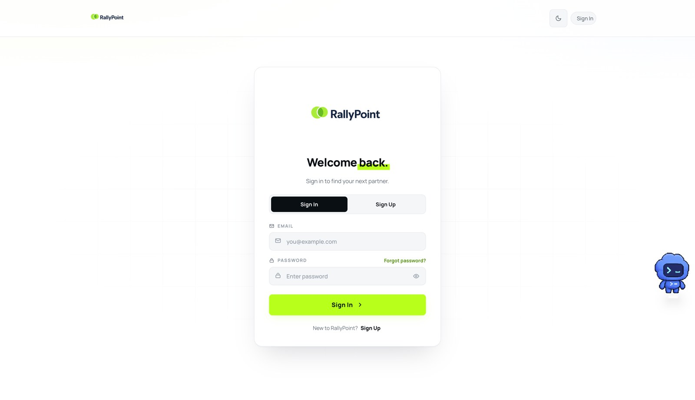
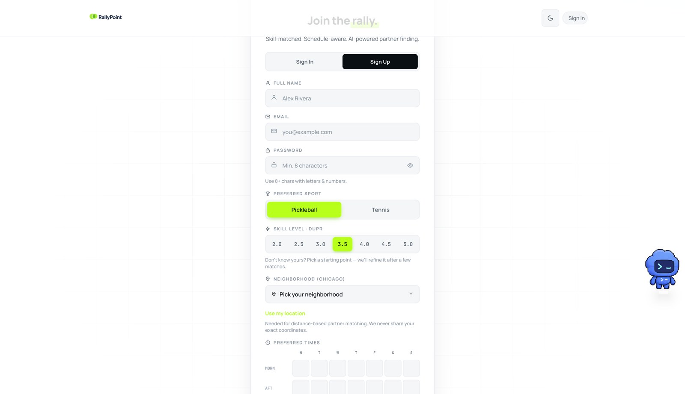
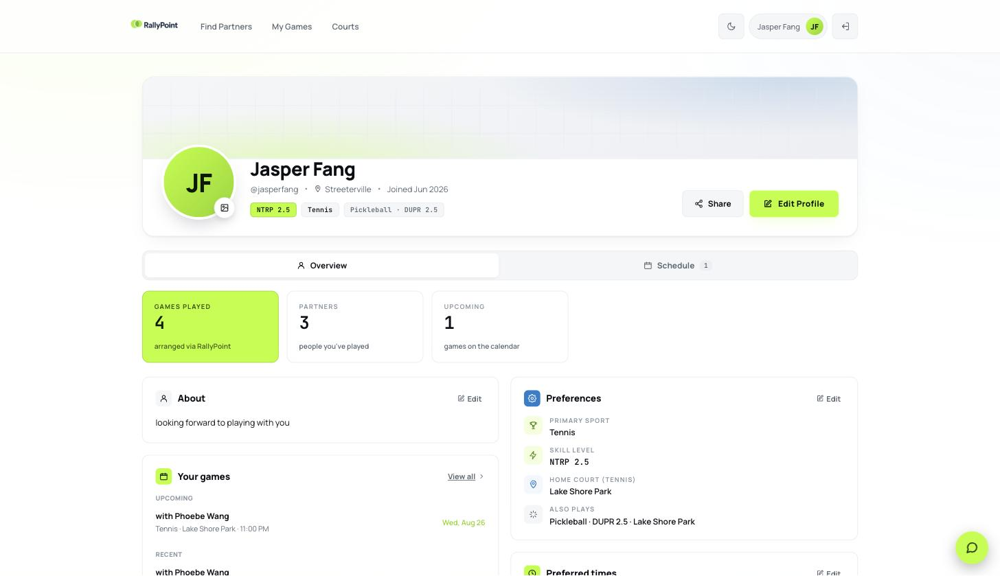
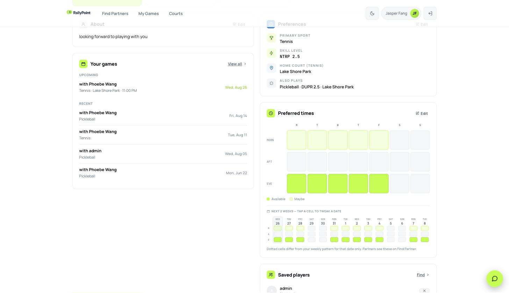
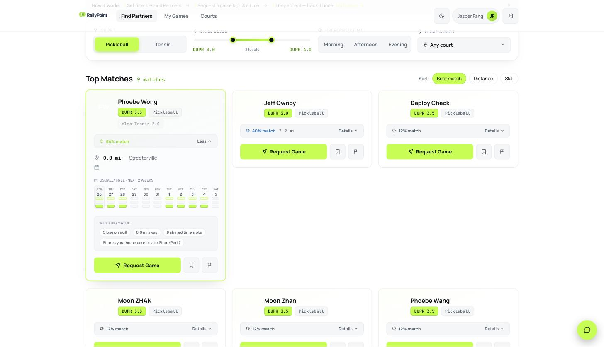
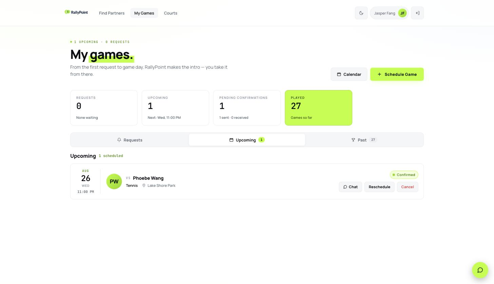
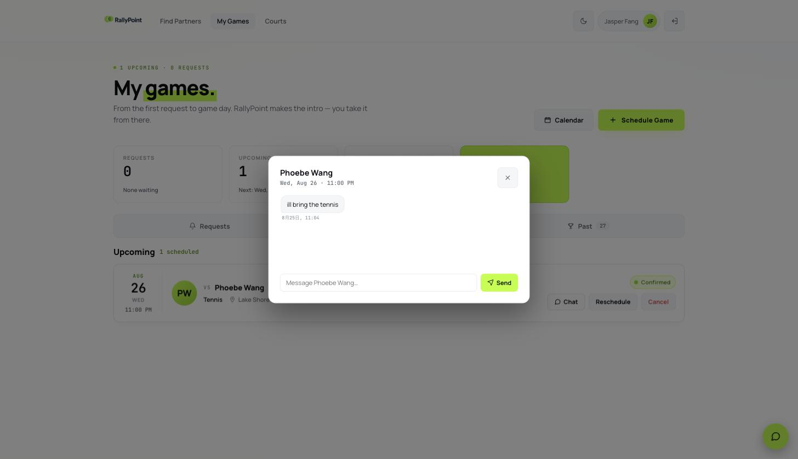

# RallyPoint — Project Documentation

**Northwestern University · ACIS 498 Capstone**
Team: Phoebe Wang · Youyang (Jasper) Fang · Yuchen Sun
Live application: <https://app.tryrallypoint.com> · API: <https://api.tryrallypoint.com>

---

## Table of Contents

1. [Production Support & Testing Scenarios](#1-production-support--testing-scenarios)
   - 1.1 Service Dependency Diagram · 1.2 Monitoring · 1.3 Common Incidents & Recovery Steps
   - Testing: 1.4 Strategy · 1.5 Backend · 1.6 Frontend · 1.7 Integration · 1.8 Manual E2E · 1.9 Post-Deployment Smoke Tests
2. [System Setup Instructions](#2-system-setup-instructions) — prerequisites, backend, frontend, database, configuration, deployment, validation
3. [Issue Diagnosis, Research, Resolution, and Sharing](#3-issue-diagnosis-research-resolution-and-sharing) — eight production issues + lessons learned
4. [System Usage Guide](#4-system-usage-guide) — end-user guide with workflows and known limitations
5. [Architecture Diagram](#5-architecture-diagram)
6. [Deployment Pipeline Overview](#6-deployment-pipeline-overview-optional-section) *(optional)*
7. [Security Considerations](#7-security-considerations-optional-section) *(optional)*

---

# 1. Production Support & Testing Scenarios


*Author: Youyang (Jasper) Fang.*

## 1.1 Service Dependency Diagram



RallyPoint consists of three deployed components and one CI pipeline:

| Component | Technology | Hosted on | Production URL / location |
|---|---|---|---|
| Frontend SPA | React 19 + TypeScript, built by Vite | Vercel (CDN) | `https://app.tryrallypoint.com` |
| Backend REST API | Flask 3, gunicorn (`-k gevent --workers 1`) | Render (web service) | `https://api.tryrallypoint.com` |
| Database | PostgreSQL (managed), 17 tables | Render (managed Postgres) | internal `DATABASE_URL` |
| CI | GitHub Actions | GitHub | runs on every push / PR; hosts nothing |

Dependency direction matters for troubleshooting: the browser talks to **both** the frontend host (static assets) and the API host (data). The frontend never talks to the database directly, and all state lives in PostgreSQL. Optional external services (Resend SMTP for verification emails, OpenAI for match-reason wording, Sentry for error tracking) degrade gracefully when their keys are absent — email sending, AI wording, and error reporting are the only features affected.

**Practical rule:** if a page renders but shows no data, suspect the API or database; if the page itself does not load, suspect Vercel or the browser cache; if data is stale on one device only, suspect a stale frontend bundle (hard refresh first).

## 1.2 Monitoring

**Logs.**

| What | Where | Notes |
|---|---|---|
| Backend request/application logs | Render → service `rallypoint-api` → **Logs** tab | Live tail; searchable. gunicorn access + Flask app logs. |
| Deploy & lifecycle events | Render → **Events** tab | Shows deploys, restarts, and crashes. `Instance failed: exit 137` = out-of-memory kill. |
| Frontend build & deploy logs | Vercel → project → **Deployments** | Each deployment keeps its build log. |
| Client-side errors | Browser DevTools Console / Network | First stop for user-reported UI issues. |
| Error tracking (optional) | Sentry project | Enabled when `SENTRY_DSN` is set. |

**Health checks.**

- `GET /api/health` returns `{"status":"ok"}` and is wired as Render's `healthCheckPath`; Render probes it continuously (these probes appear in logs with the `Render/1.0` user agent — they are normal, not attack traffic).
- `GET /api/auth/me` with a valid session verifies the full auth path (cookie → JWT → DB read).
- Database health: Render → the `rallypoint-db` database page shows status, connections, and storage.
- Frontend health: loading `https://app.tryrallypoint.com` and refreshing a deep route (e.g. `/verify-email`) must both return the SPA, not a 404.

**Keep-warm.** A scheduled request against the API reduces free-tier cold starts; if it stops running, the only symptom is slower first requests (see incident 3 below).

## 1.3 Common Incidents & Recovery Steps

**Incident 1 — API down / service crash (users see failed requests everywhere).**

1. Check Render **Events**: a crash loop or `exit 137` (OOM) will be listed.
2. Check Render **Logs** for the stack trace at crash time.
3. Recovery: **Manual Deploy → Deploy latest commit** restarts the service; for OOM, upgrade the instance plan (this project moved to Starter after repeated 502s traced to `exit 137` on the free tier).
4. Verify: `GET /api/health` returns ok; sign in and load My Games.

**Incident 2 — Database connection loss (`OperationalError`, 500s on data routes while `/api/health` may still pass).**

1. Check the Render database page: status, connection count, storage.
2. Note: Render's **free** Postgres expires ~30 days after creation — an expired database looks like a permanent connection loss. Paid databases persist.
3. Recovery: restart the API service (Manual Deploy) so the connection pool is rebuilt; if the database was recreated, update `DATABASE_URL`, redeploy, and let startup migrations (`manage.py upgrade-db`) rebuild the schema; re-seed reference data (`manage.py import-courts --if-empty` runs automatically).
4. Verify: sign-in works and existing games load.

**Incident 3 — First request hangs ~30–60 s after idle (free-tier cold start).**

Not a crash. The UI shows the WakeBanner ("server is waking up") after ~4 s and the request completes when the instance wakes. No action needed; to reduce occurrences keep the keep-warm ping active or upgrade the plan. Never cancel the waking request — it is what wakes the server.

**Incident 4 — Code merged but behavior unchanged in production.**

Render auto-deploy is **off** for this service (Blueprint-managed). After every merge to `main`, someone must click **Manual Deploy → Deploy latest commit** in the Render dashboard, *after* the merge (deploying first builds the old commit). Vercel deploys automatically on merge. Verify by probing a newly added endpoint directly before testing through the UI.

**Incident 5 — One user sees the old UI (others see the new one).**

Stale cached bundle. Hard refresh (Cmd/Ctrl+Shift+R). This is a client cache issue, not a deployment issue — check it before filing a bug.

**Incident 6 — Migration failure at startup (service restarts repeatedly, logs show Alembic error).**

1. Read the Alembic error in Render Logs; identify the failing revision.
2. Never edit production schema by hand. Fix the migration in code, merge, Manual Deploy.
3. `manage.py upgrade-db` is idempotent — rerunning it is safe.
4. Verify: service starts, `/api/health` ok, feature that needed the new column works.

**Incident 7 — Real-time updates stop (no live invite/chat updates; polling still works on refresh).**

1. Confirm the stream endpoint: an authenticated `GET /api/stream` should hold open and emit keepalives every ~15 s.
2. Remember the architectural constraint: the SSE broker is in-process, so production must run **one** gunicorn worker (`-k gevent --workers 1`). If worker count was changed, events published in one process never reach subscribers in another — restore `--workers 1`.
3. Verify with two browsers: an invite action in one appears in the other without refresh.


---


## Testing Scenarios & Results

*Author: Yuchen Sun.*

## 1.4 Testing Strategy

RallyPoint uses multiple levels of testing to validate the complete
full-stack system. Automated backend testing covers the Flask REST API,
authentication, business logic, ORM behavior, and database state.
Frontend testing validates React components, authentication state,
real-time behavior, and user-interface logic. TypeScript type checking
and production builds provide additional contract validation between the
frontend and backend.

The project also uses manual end-to-end testing to validate complete
workflows across the deployed frontend, backend, and database.

The original Milestone 3 integration validation recorded:

  -----------------------------------------------------------------------
  Testing Layer           Tool / Method           Milestone 3 Result
  ----------------------- ----------------------- -----------------------
  Backend API + Database  Pytest + pytest-flask   124 passed

  Frontend Unit /         Vitest + Testing        7 passed
  Integration             Library                 

  API Contract / Type     `tsc --noEmit`          0 errors
  Validation                                      

  Production Build        Vite                    Successful

  Manual End-to-End       Browser + DevTools      12 scenarios

  CI                      GitHub Actions          Run on push and pull
                                                  request
  -----------------------------------------------------------------------

Since Milestone 3, additional real-time notification, chat,
unread-message, and modal functionality has expanded the automated
suite. The latest project state records:

-   **158 backend Pytest tests passed**
-   **42 frontend Vitest tests passed**
-   TypeScript type checking passed
-   Production frontend build passed

This layered approach reduces the chance that a feature can work
correctly in isolation while failing when integrated with another system
component.

## 1.5 Backend Automated Testing

Backend tests are located under:

`backend/tests/`

The backend tests create a test Flask application, perform HTTP requests
against real application routes, and validate both API responses and
database effects.

The Milestone 3 baseline included the following coverage:

  -----------------------------------------------------------------------
  Test Area                           Representative Coverage
  ----------------------------------- -----------------------------------
  Authentication                      Signup, login, logout, JWT cookies,
                                      CSRF, verification, password reset,
                                      rate limiting

  Game Invites                        Create invite, confirmation, time
                                      proposal, acceptance, decline,
                                      cancellation

  User Profile                        Profile updates, availability,
                                      overrides, profile photos

  Administration                      Admin authorization, statistics,
                                      moderation

  Sessions                            Accept, decline, cancel, and
                                      reschedule sessions

  Reports                             Trust and safety reporting
                                      workflows

  Courts                              Court search, details, favorites,
                                      check-ins, admin CRUD

  Player Matching                     Player search, saved players,
                                      matching score logic

  Support                             Support chat, escalation, support
                                      ticket management

  Account Deletion                    Cascade behavior across related
                                      database records

  Appointments / Open Games           Create, join, leave, and waitlist
                                      behavior
  -----------------------------------------------------------------------

Later development added automated tests for:

-   Server-Sent Events authentication and delivery
-   Real-time invite updates
-   Per-user stream limits
-   Stream cleanup and HEAD-request regression protection
-   Real-time game chat
-   Chat authorization and input validation
-   Chat unread-count calculations
-   Message read-position behavior
-   Chat modal behavior
-   Modal focus and event handling
-   Portal rendering and mobile layout

### Representative Backend Test Cases

  ---------------------------------------------------------------------------------------
  ID             Test Scenario    Expected Result         Actual Result    Status
  -------------- ---------------- ----------------------- ---------------- --------------
  BE-01          Valid user       HTTP 201; user record   User created     Pass
                 signup           created                 successfully     

  BE-02          Valid login      HTTP 200; authenticated Authentication   Pass
                                  session established     succeeded        

  BE-03          Protected        HTTP 401                Request rejected Pass
                 endpoint without                         with 401         
                 valid                                                     
                 authentication                                            

  BE-04          Invalid          HTTP 422 with           Structured field Pass
                 signup/input     structured validation   error returned   
                 payload          error                                    

  BE-05          CSRF-protected   Request rejected        Unauthorized     Pass
                 write without                            write prevented  
                 valid CSRF token                                          

  BE-06          Create game      Invite and proposal     Database updated Pass
                 invite           records created         correctly        

  BE-07          Accept proposed  Session created and     Session created  Pass
                 game time        invite state updated    successfully     

  BE-08          Unauthorized     Resource not exposed to Access denied    Pass
                 user accesses    unauthorized user                        
                 private chat                                              

  BE-09          Chat message     HTTP 422                Invalid message  Pass
                 exceeds                                  rejected         
                 validation rules                                          

  BE-10          SSE stream       Connection rejected     Unauthorized     Pass
                 opened without                           stream prevented 
                 authentication                                            

  BE-11          Multiple SSE     Oldest connection is    Stream cap       Pass
                 streams exceed   evicted                 enforced         
                 per-user limit                                            

  BE-12          Database         No                      Migration        Pass
                 migration reruns duplicate/destructive   process remains  
                                  migration behavior      idempotent       
  ---------------------------------------------------------------------------------------

## 1.6 Frontend Automated Testing

Frontend tests use:

-   Vitest
-   React Testing Library
-   jsdom
-   TypeScript compiler validation

Important areas tested include authentication state, API integration
behavior, loading states, real-time event handling, chat components,
unread indicators, and modal behavior.

### Representative Frontend Test Cases

  ------------------------------------------------------------------------------
  ID             Test Scenario   Expected Result  Actual Result   Status
  -------------- --------------- ---------------- --------------- --------------
  FE-01          Application     User state       User session    Pass
                 loads existing  hydrates from    displayed       
                 authenticated   `/auth/me`       correctly       
                 session                                          

  FE-02          Login succeeds  Global auth      Authenticated   Pass
                                 state updates    interface       
                                                  displayed       

  FE-03          API returns 401 User is signed   Expired session Pass
                                 out and          handled         
                                 redirected       globally        
                                 appropriately                    

  FE-04          API request is  Loading state    Slow-server     Pass
                 slow            remains visible; banner          
                                 wake-up notice   displayed       
                                 appears                          

  FE-05          Invite SSE      Invite/session   UI updates      Pass
                 event received  data is          without manual  
                                 refreshed        refresh         

  FE-06          Chat SSE event  Correct chat     New message     Pass
                 received        query is         appears         
                                 refreshed                        

  FE-07          User opens chat Modal remains    Modal displays  Pass
                 dialog          stable and       correctly       
                                 inside viewport                  

  FE-08          Modal receives  Body lock and    No flicker      Pass
                 parent          event listeners  observed        
                 rerenders       remain stable                    

  FE-09          Chat modal      Portal moves     No clipping     Pass
                 rendered inside modal to         occurs          
                 transformed     document body                    
                 card                                             

  FE-10          TypeScript API  CI reports       Contract        Pass
                 contract        incompatible     mismatch caught 
                 changes         types            before          
                                                  deployment      
  ------------------------------------------------------------------------------

## 1.7 Integration Testing

A significant portion of the backend suite functions as integration
testing rather than isolated unit testing because requests pass through
the Flask route layer, validation layer, authentication layer, ORM, and
test database.

Examples include:

### Frontend ↔ Backend Authentication

**Scenario:** User signs in through the React frontend.

**Expected:**\
The backend validates the credentials, issues the authentication cookie,
and `/auth/me` returns the current user.

**Actual:**\
The authenticated session is loaded successfully and reflected in the
frontend application state.

**Result:** Pass

### Backend ↔ Database Invite Workflow

**Scenario:** One player sends an invite and the other accepts a
proposed time.

**Expected:**\
The backend persists the invite, time proposal, and resulting game
session.

**Actual:**\
The correct records are created and both users see the updated game
state.

**Result:** Pass

### Backend ↔ Real-Time SSE Channel

**Scenario:** One user changes the status of an invite.

**Expected:**\
The write is committed to the database and an SSE notification tells the
affected clients to refresh their normal authenticated queries.

**Actual:**\
Both users receive the update without manually refreshing the page.

**Result:** Pass

### Backend ↔ Frontend Chat

**Scenario:** Player A sends a message to Player B in a confirmed game.

**Expected:**\
The backend stores the message, publishes a chat event, and Player B's
frontend refetches the affected conversation.

**Actual:**\
Messages appear in near real time and the unread indicators update
correctly.

**Result:** Pass

## 1.8 Manual End-to-End Test Scenarios

The following end-to-end scenarios were used to validate the integrated
application.

  -----------------------------------------------------------------------------------
  \#                User Action     Expected Result Actual Result       Status
  ----------------- --------------- --------------- ------------------- -------------
  1                 Sign up for a   Account is      Account             Pass
                    new account     created and     successfully        
                                    verification    created             
                                    workflow begins                     

  2                 Log in          Authenticated   Login successful    Pass
                                    session                             
                                    established and                     
                                    user                                
                                    information                         
                                    loads                               

  3                 Edit profile    Changes remain  Changes persisted   Pass
                    and             after reload                        
                    availability,                                       
                    then reload                                         

  4                 Upload a        New avatar      Photo displayed     Pass
                    profile photo   appears and     correctly           
                                    persists                            

  5                 Open Find       Matching        Partner results     Pass
                    Partner         results and     displayed           
                                    reason chips                        
                                    load                                

  6                 Save another    Saved status    Saved-player state  Pass
                    player          remains after   persisted           
                                    reload                              

  7                 Send a game     Other account   Invite visible to   Pass
                    invite          receives the    invited user        
                                    invitation                          

  8                 Other account   Confirmed       Session appears for Pass
                    accepts a       session is      both players        
                    proposed time   created                             

  9                 Favorite and    Court state     Favorite/check-in   Pass
                    check in to a   updates and     recorded            
                    court           persists                            

  10                Admin resolves  Ticket status   Ticket successfully Pass
                    a support       changes         resolved            
                    ticket                                              

  11                Submit          HTTP 422 and    User sees           Pass
                    malformed data  readable        structured          
                                    field-level     validation message  
                                    error                               

  12                Use an expired  HTTP 401 and    Application clears  Pass
                    session         clean sign-out  expired session     
  -----------------------------------------------------------------------------------

DevTools Network was used during the manual workflow to verify API
requests and responses. Database-backed actions were also checked
through subsequent REST reads and persistence after page reload.

## 1.9 Post-Deployment Smoke Tests

The following smoke tests should be completed after production
deployment.

  -----------------------------------------------------------------------
  ID                      Smoke Test              Expected Result
  ----------------------- ----------------------- -----------------------
  SM-01                   Open production         Application loads
                          frontend                without fatal error

  SM-02                   Request `/api/health`   Returns
                                                  `{"status":"ok"}`

  SM-03                   Sign in using a valid   Login succeeds
                          account                 

  SM-04                   Call `/auth/me`         Current user data
                                                  returned

  SM-05                   Open Find Partner       Matching data loads

  SM-06                   Open My Games           Sessions and invites
                                                  load

  SM-07                   Send or update an       Other account receives
                          invitation              update

  SM-08                   Open confirmed-game     Chat history loads
                          chat                    

  SM-09                   Send chat message       Other user receives
                                                  message/update

  SM-10                   Submit invalid input    Structured error is
                                                  displayed

  SM-11                   Refresh a deep frontend React route loads
                          route                   rather than Vercel 404

  SM-12                   Review application/API  No unexpected critical
                          logs                    errors
  -----------------------------------------------------------------------

For full-stack releases, the backend should be verified before assuming
the frontend is ready because Vercel and Render can finish their
automatic deployments at different times.


---


# 2. System Setup Instructions

*Author: Youyang (Jasper) Fang.*

These instructions take a new developer from an empty machine to a running local stack, and then through a production deployment. Follow them top to bottom; each stage ends with a validation step.

## 2.1 Prerequisites

- **OS:** macOS, Linux, or Windows + WSL2.
- **Python 3.11+** (`python3 --version`)
- **Node.js 20+** and npm (`node --version`)
- **Git**
- **PostgreSQL — not required locally.** Local development uses SQLite automatically; production uses Render's managed PostgreSQL. The switch is only the `DATABASE_URL` environment variable — no code changes.
- Accounts for production deployment: GitHub, Vercel, Render. Optional: Resend (email), OpenAI (AI wording), Sentry (error tracking).

Clone the repository:

```bash
git clone https://github.com/phoebewong214/rallypoint.git
cd rallypoint
```

## 2.2 Backend Setup (Flask)

```bash
cd backend
python3 -m venv .venv
source .venv/bin/activate          # Windows: .venv\Scripts\activate
pip install -r requirements.txt
cp .env.example .env               # local defaults work out of the box
python seed.py                     # creates the SQLite DB + sample users
python app.py                      # → http://localhost:5050
```

Notes:

- `python app.py` runs the dev server with `threaded=True`. Keep threading on — the SSE endpoint (`GET /api/stream`) holds a connection open per tab and would otherwise starve all other requests.
- Apple Silicon / Python 3.13+: if `psycopg2-binary` fails to install, it is only needed for Postgres; local SQLite development does not use it.

**Validation:**

```bash
curl http://localhost:5050/api/health
# → {"status":"ok"}

curl -X POST http://localhost:5050/api/auth/login \
  -H "Content-Type: application/json" \
  -d '{"email":"alex@rally.app","password":"rally1234"}'
# → 200 with a Set-Cookie header (seeded sample account)
```

## 2.3 Frontend Setup (React + Vite)

```bash
cd frontend
npm install
npm run dev                        # → http://localhost:3000
```

The frontend reads its API base URL from `VITE_API_URL`. Local development is preconfigured by `frontend/.env.development`, which points at `http://localhost:5050/api` — no edits needed.

**Validation:** open `http://localhost:3000`, sign in as `alex@rally.app` / `rally1234`, and confirm Find Partners shows match cards with reason chips. Open a second private-window session as `maya@rally.app` to exercise two-account flows.

## 2.4 Database Setup

**Local:** nothing to install. `python seed.py` creates the SQLite file, applies the schema, and inserts sample users and Chicago courts.

**Schema changes** are managed by Alembic (Flask-Migrate). The revision chain is linear; to apply pending migrations to any database:

```bash
python manage.py upgrade-db        # idempotent — safe to run repeatedly
```

**Production:** the Render Blueprint (`render.yaml`) provisions a managed PostgreSQL database and injects its connection string as `DATABASE_URL`. Migrations are applied automatically at every deploy because the service start command runs `manage.py upgrade-db` before gunicorn (see 2.6). No manual SQL is ever run against production.

## 2.5 Configuration & Secrets Management

All configuration is environment variables; **no secrets are committed to the repository** (`.env` is git-ignored; `.env.example` documents every variable with safe defaults).

| Variable | Purpose | Local | Production (Render) |
|---|---|---|---|
| `SECRET_KEY` | JWT signing | dev default | generated by Render |
| `DATABASE_URL` | DB connection | unset → SQLite | injected from managed Postgres |
| `COOKIE_SECURE` / `COOKIE_SAMESITE` | cookie flags | dev defaults | `true` / `Lax` |
| `COOKIE_DOMAIN` | share cookie across subdomains | unset | `.tryrallypoint.com` |
| `CORS_ORIGINS` | allowed browser origin | localhost | `https://app.tryrallypoint.com` |
| `APP_BASE_URL` | links in emails | localhost | `https://app.tryrallypoint.com` |
| `SMTP_HOST/USER/PASSWORD/FROM` | verification & support email (Resend) | optional | set in Render dashboard |
| `SUPPORT_ADMIN_EMAIL` | where support escalations are emailed | optional | set in dashboard |
| `BOOTSTRAP_ADMIN_EMAIL` | auto-promote first admin on deploy | optional | set in dashboard |
| `OPENAI_API_KEY` | AI match-reason wording (optional) | blank = heuristic wording | set in dashboard |
| `SENTRY_DSN` | error tracking (optional) | blank = disabled | set in dashboard |
| `VITE_API_URL` | frontend → API base URL | `.env.development` | set in **Vercel** project settings |

Secrets entered in the Render/Vercel dashboards stay in those platforms; the repository never contains a production credential.

## 2.6 Build & Deployment Steps

**Backend + database (Render, Blueprint):**

1. Render → **New → Blueprint** → select the repository. Render reads `render.yaml`, which provisions the `rallypoint-api` web service and the `rallypoint-db` Postgres.
2. Fill the dashboard-only environment variables (the `sync: false` entries: `APP_BASE_URL`, `CORS_ORIGINS`, `COOKIE_DOMAIN`, SMTP values, optional keys).
3. Start command (already in the Blueprint):
   `python manage.py upgrade-db && (python manage.py import-courts --if-empty || echo "…continuing") && gunicorn wsgi_gevent:app --bind 0.0.0.0:$PORT -k gevent --workers 1 --timeout 60`
   — migrations first, court seeding (no-op when populated), then a **single** gevent worker (required by the in-process SSE broker).
4. **Ongoing deploys are manual:** after each merge to `main`, click **Manual Deploy → Deploy latest commit**.

**Frontend (Vercel):**

1. Vercel → **New Project** → import the repository, root directory `frontend`.
2. Set `VITE_API_URL` to the deployed API, e.g. `https://api.tryrallypoint.com/api`.
3. `frontend/vercel.json` rewrites all routes to `/index.html` so deep links (e.g. email verification links) load the SPA instead of a 404.
4. Vercel builds (`vite build`) and deploys automatically on every merge to `main`.

**Custom domains:** `app.` (Vercel) and `api.` (Render) are subdomains of one domain so the auth cookie (`COOKIE_DOMAIN=.tryrallypoint.com`) flows between them with `SameSite=Lax`.

## 2.7 Setup Validation Checklist

Local (all must pass):

1. `curl localhost:5050/api/health` → `{"status":"ok"}`
2. `cd backend && python -m pytest` → 158 passed
3. `cd frontend && npx vitest run` → 42 passed; `npx tsc --noEmit` → 0 errors
4. Browser: sign in, send an invite from one seeded account, accept it from another, open the game chat.

Production (after any deploy): run the post-deployment smoke tests SM-01 … SM-12 in Section 1.9, in order — backend first, then frontend.


---


# 3. Issue Diagnosis, Research, Resolution, and Sharing

*Author: Yuchen Sun.*

## 3.1 Issue 1 --- Login Worked Locally but Failed in Production

### Description

Authentication worked during local development. After deployment, the
login endpoint returned HTTP 200, but subsequent authenticated API calls
returned HTTP 401.

Expected behavior was for the user's authenticated session to persist
after login. Actual behavior was that the backend treated later requests
as anonymous.

### Environment

-   React frontend hosted on Vercel
-   Flask backend hosted on Render
-   JWT stored in an httpOnly cookie
-   Production browser environment

### Steps to Reproduce

1.  Deploy frontend using a `*.vercel.app` URL.
2.  Deploy backend using a `*.onrender.com` URL.
3.  Log in successfully.
4.  Make a protected API request.
5.  Observe HTTP 401 even though the login request succeeded.

### Diagnosis

The frontend and API were hosted on different sites. The authentication
cookie used `SameSite=Lax`, so the browser did not attach the cookie to
cross-site API requests.

The failure was difficult to identify because the login request itself
succeeded and no application exception occurred. The browser simply did
not send the expected cookie.

### Research Process

The team inspected:

-   Chrome DevTools Network request and response headers
-   Browser cookie behavior
-   CORS configuration
-   Vercel and Render deployment configuration
-   Existing authentication and CSRF implementation

### Resolution

The frontend and backend were moved to subdomains of the same domain:

-   `app.tryrallypoint.com`
-   `api.tryrallypoint.com`

The production configuration was updated to use:

-   `COOKIE_DOMAIN=.tryrallypoint.com`
-   `CORS_ORIGINS=https://app.tryrallypoint.com`
-   credentialed API requests

This preserved the project's `SameSite=Lax` authentication design while
allowing the cookie to flow between the frontend and API.

### Outcome Verification

After redeployment:

1.  Login returned HTTP 200.
2.  The authentication cookie appeared in the browser.
3.  Subsequent `/auth/me` and protected API requests returned
    authenticated data rather than 401.
4.  Authentication persisted across navigation and reloads.

## 3.2 Issue 2 --- Render Cold Start Looked Like an Application Crash

### Description

After the production API had been idle for a period of time, opening
RallyPoint could leave the UI showing loading skeletons for a long time.

Expected behavior was a normally responsive application. Actual behavior
was a long delay that caused testers to assume the site had crashed.

### Environment

-   Production frontend: Vercel
-   Production backend: Render
-   Render free-tier hosting
-   React API client

### Steps to Reproduce

1.  Allow the backend to remain unused long enough to sleep.
2.  Open the production frontend.
3.  Trigger the first API request.
4.  Observe a long response delay.

### Diagnosis

The application code was not crashing. Render's free service was
sleeping after inactivity, and the first request had to wake the
backend.

Cancelling that initial request would make the problem worse because the
request itself was needed to wake the server.

### Research Process

The team used:

-   Browser Network timing information
-   Render deployment behavior and service logs
-   Direct API requests
-   Comparison between warm and cold request response times

### Resolution

The frontend API client was changed so slow requests are not prematurely
aborted.

When an API request exceeds approximately four seconds, RallyPoint
raises a ref-counted `api:slow` state. The `WakeBanner` component
displays a non-blocking message informing users that the server is
waking up.

A scheduled keep-warm request also reduces the frequency of cold starts.

### Outcome Verification

The application was tested after an idle period.

The backend still required time to wake because that is an
infrastructure limitation, but:

-   the request was allowed to complete,
-   the application did not falsely report a crash,
-   the user saw a clear status message,
-   the banner disappeared automatically when requests completed.

## 3.3 Issue 3 --- Email Verification Deep Link Returned a Vercel 404

### Description

Verification links sent by email pointed to a route such as:

`/verify-email?token=...`

Navigating to the route inside the application worked, but clicking the
link directly from the email produced a Vercel 404 page.

### Environment

-   React single-page application
-   React Router
-   Vercel static hosting
-   Email verification workflow

### Steps to Reproduce

1.  Sign up for an account.
2.  Receive the email verification message.
3.  Click the verification link from the email.
4.  Observe Vercel's 404 response.

### Diagnosis

`/verify-email` was a client-side React route, not a physical file on
the Vercel server.

During in-app navigation, React Router handled the route correctly.
During a direct browser load, Vercel attempted to locate a static
resource at `/verify-email` and returned 404.

### Research Process

The team compared:

-   in-app React Router navigation,
-   direct browser navigation,
-   Vercel routing behavior,
-   the production Network response.

### Resolution

`frontend/vercel.json` was configured to rewrite frontend routes to
`/index.html`.

This allows the React application to load first and React Router to
handle the requested path.

### Outcome Verification

After deployment:

1.  A new verification email was generated.
2.  The verification link was opened directly.
3.  Vercel returned the SPA rather than a 404.
4.  React Router loaded the verification screen.
5.  The verification workflow completed successfully.

## 3.4 Issue 4 --- Profile Photos Failed and API Type Drift Broke CI

### Description

Profile-photo uploads worked, but avatars appeared as broken images in
production.

A related integration issue occurred when the backend began returning
`photoVersion`, but the frontend `SavedPlayer` interface did not contain
the same field.

### Environment

-   React frontend
-   Flask backend
-   Database-backed profile images
-   TypeScript
-   GitHub Actions CI

### Steps to Reproduce

1.  Upload a profile photo.
2.  Render the photo using an `` element.
3.  Observe the image request fail.
4.  Update code to use `photoVersion`.
5.  Run the frontend typecheck with the old `SavedPlayer` interface.

### Diagnosis

Two separate integration problems existed.

First, authenticated image requests were difficult to support reliably
through normal `` behavior when frontend and API hosting boundaries
were involved.

Second, the backend/frontend API contract had drifted: the API returned
`photoVersion`, but the frontend interface did not define it.

### Research Process

The team used:

-   DevTools image request inspection
-   API endpoint testing
-   Browser caching behavior
-   TypeScript compiler output
-   GitHub Actions CI output

The missing TypeScript property was reported during `tsc --noEmit`,
preventing the incompatible build from passing CI.

### Resolution

The photo read endpoint was made a public GET endpoint while upload and
delete operations remained authenticated.

A cache-busting query value:

`?v=<photoVersion>`

was added and incremented after uploads.

The `SavedPlayer` TypeScript definition was also updated with the
missing `photoVersion` field.

### Outcome Verification

After the fix:

-   profile photos loaded successfully,
-   replacing a photo showed the new version rather than stale cached
    content,
-   TypeScript type checking passed,
-   the production build completed successfully.

This incident demonstrated the value of static type checking as an
integration test.

## 3.5 Issue 5 --- New Full-Stack Feature Temporarily Returned 404 After Merge

### Description

Immediately after merging a full-stack feature, the new frontend
deployed successfully but calls to newly added backend endpoints
returned 404.

Expected behavior was for the complete feature to become available after
merge. Actual behavior was a temporary mismatch between frontend and
backend versions.

### Environment

-   GitHub `main` branch
-   Automatic Vercel deployment
-   Automatic Render deployment

### Steps to Reproduce

1.  Merge a change containing both frontend and backend updates.
2.  Wait for Vercel to complete deployment.
3.  Open the new frontend before the Render deployment completes.
4.  Trigger a newly added backend endpoint.
5.  Observe HTTP 404.

### Diagnosis

Vercel and Render deploy independently and do not complete at exactly
the same time.

The frontend normally became available sooner, producing a temporary
state where:

**new frontend → old backend**

The frontend therefore called API routes that had not yet reached
production.

### Research Process

The team used:

-   Vercel deployment status
-   Render deployment status
-   Chrome DevTools Network
-   direct `curl` requests to the API

A JSON API response was used to confirm that the expected backend
version was live, while an unexpected 404 indicated that deployment was
still incomplete.

### Resolution

The team documented a deployment validation procedure:

1.  Allow backend deployment to complete.
2.  Probe new backend functionality directly.
3.  Confirm the API version is live.
4.  Test the frontend workflow only after the backend is ready.

For a larger production system, backend-first deployment or API
versioning would reduce this risk further.

### Outcome Verification

After Render completed deployment and the API was directly validated,
the same frontend workflow succeeded without code changes.

## 3.6 Issue 6 --- Production Database Schema Drift

### Description

Features adding new database fields worked locally but could fail in
production with errors such as:

`column does not exist`

Expected behavior was for the production schema to evolve with
application releases. Actual behavior was that an older production
database could remain behind the application's SQLAlchemy model
definitions.

### Environment

-   Flask
-   SQLAlchemy
-   PostgreSQL on Render
-   Alembic migrations

### Steps to Reproduce

1.  Deploy an initial database schema.
2.  Add a new model column locally.
3.  Deploy application code without applying a schema migration.
4.  Access functionality that reads or writes the new field.
5.  Observe a database error.

### Diagnosis

Creating tables from SQLAlchemy models is not the same as performing
schema migrations. A `create_all()`-style workflow can create missing
tables but is not a reliable mechanism for evolving existing production
tables.

### Research Process

The team reviewed:

-   SQLAlchemy model behavior
-   production PostgreSQL errors
-   existing database initialization logic
-   Alembic migration workflow
-   Render deployment/startup configuration

### Resolution

The project moved to an Alembic migration-based deployment workflow.

The backend deployment start process now runs:

`python manage.py upgrade-db`

before starting the application.

Existing pre-migration databases can be adopted into the migration
history and then upgraded. Future schema changes are represented
explicitly as migration revisions.

### Outcome Verification

The migration chain was tested against fresh and existing database
states.

Successful verification required:

-   migrations completing without manual schema edits,
-   repeated upgrade runs remaining safe,
-   the application starting after migration,
-   new columns/tables being available to production code.

This replaced the earlier schema-sync workaround with a production-style
migration process.

## 3.7 Issue 7 --- Real-Time SSE Streams Could Leak or Exhaust the Worker

### Description

During hardening of the real-time invitation feature, two risks were
identified:

1.  a `HEAD /api/stream` request could create a stream subscription that
    was never cleaned up;
2.  one account could open an excessive number of long-lived SSE
    connections.

### Environment

-   Flask backend
-   Server-Sent Events
-   Gunicorn
-   gevent
-   single production worker
-   Render

### Steps to Reproduce

For the leak:

1.  Send repeated `HEAD` requests to `/api/stream`.
2.  Do not consume a response body.
3.  Observe that subscriptions could remain registered.

For the connection-limit issue:

1.  Authenticate as one user.
2.  Open many SSE connections.
3.  Observe resource consumption on the single worker.

### Diagnosis

The SSE endpoint had been exempted from normal per-minute rate limiting
because each connection is intentionally long-lived.

The original subscription occurred too early in the request lifecycle. A
HEAD response does not iterate the streaming body, so normal generator
cleanup could be skipped.

There was also no independent limit on simultaneous streams per account.

### Research Process

The team used:

-   automated regression tests,
-   direct concurrent connection tests,
-   Gunicorn/gevent behavior,
-   stream broker state,
-   adversarial review of the new SSE implementation.

### Resolution

Subscription creation was moved inside the response generator so no body
iteration means no subscription is created.

A per-user stream cap was added. When a user exceeds the limit, the
oldest stream is evicted cleanly.

Production also uses a single gevent worker because the current pub/sub
broker is process-local.

### Outcome Verification

Automated and production-stack testing confirmed that:

-   repeated HEAD requests no longer leaked subscriptions,
-   excess connections were evicted,
-   the worker remained responsive,
-   normal real-time invite delivery continued to work.

## 3.8 Issue 8 --- Chat Dialog Flickered and Escaped Its Card

### Description

Production acceptance testing found that opening the game-chat dialog
could cause the page to flicker, and chat bubbles could escape or become
clipped by the session card.

### Environment

-   React
-   shared `Modal` component
-   chat modal
-   session card using CSS transform/overflow
-   desktop and mobile browsers

### Steps to Reproduce

1.  Open the My Games page.
2.  Open a game chat.
3.  Allow chat unread/session queries to refresh.
4.  Observe repeated page flickering.
5.  Test the same dialog inside a transformed session card on mobile.
6.  Observe clipping/incorrect fixed-position behavior.

### Diagnosis

Two independent problems were found.

First, the modal effect depended on an inline `onClose` callback. Parent
rerenders recreated the function, repeatedly releasing and reapplying
the document body scroll lock and keyboard listener.

Second, the chat modal was mounted inside a session card that used CSS
`transform`. A transformed ancestor becomes the containing block for
fixed-position descendants. Combined with `overflow:hidden`, the
supposedly full-screen dialog was positioned and clipped inside the
card.

### Research Process

The team used:

-   React component analysis
-   browser layout measurements
-   Chrome-based real-browser testing
-   desktop and mobile viewport testing
-   mutation checking against the previous implementation

### Resolution

The modal lifecycle was made stable across parent rerenders using refs
and a mount-only effect.

The chat dialog was rendered through a React portal to `document.body`,
removing it from the transformed/clipped card hierarchy.

Toast stacking order was also adjusted so notifications remain visible
above the modal.

### Outcome Verification

Real-browser testing covered both desktop and mobile layouts.

Verification confirmed:

-   no repeated body-style changes during live rerenders,
-   backdrop covered the entire viewport,
-   dialog and bubbles remained inside the intended layout,
-   mobile presentation remained usable,
-   toast notifications remained above the dialog,
-   frontend automated tests remained green.

## 3.9 Lessons Learned and Knowledge Sharing

The most significant defects were not simple syntax errors. They
appeared at system boundaries:

-   browser security policy ↔ authentication
-   frontend routing ↔ cloud hosting
-   frontend release ↔ backend release
-   ORM models ↔ production database schema
-   long-lived SSE connections ↔ server concurrency model
-   React component lifecycle ↔ real-time query refreshes
-   CSS containing blocks ↔ modal layout

For that reason, RallyPoint's debugging process evolved toward
repeatable production guardrails rather than one-time fixes.

The main practices adopted were:

1.  Inspect real request and response headers in DevTools before
    changing code.
2.  Use direct API requests to separate frontend issues from backend
    issues.
3.  Run backend tests, frontend tests, TypeScript type checking, and
    production builds in CI.
4.  Apply database changes through explicit migrations.
5.  Validate cloud services independently before testing the full user
    workflow.
6.  Convert important production bugs into automated regression tests.
7.  Document deployment constraints and known limitations so future
    maintainers do not have to rediscover them.


---


# 4. System Usage Guide

*Author: Phoebe Wang. This guide is written for end users — no technical background needed.*

## 4.1 What is RallyPoint?

RallyPoint helps everyday tennis and pickleball players find a compatible partner and get an actual game on the calendar. It matches you with nearby players at your level who are free when you are, explains *why* each person is a good match, and then walks you from "found someone" all the way to a confirmed game — including a built-in chat for the two of you to sort out details.

## 4.2 Accessing the Application

- **Web address:** `https://app.tryrallypoint.com` — works in any modern browser on desktop or phone; nothing to install.
- **Creating an account:** click **Sign up**, enter your email and a password, then click the verification link we email you.
- **Test accounts (for graders/reviewers):** two pre-made accounts are provided in the submission materials so you can try both sides of a game — sign into one account in a normal browser window and the other in a private/incognito window.





**Tip:** the first page load after the app has been idle can take up to a minute — a small banner will tell you the server is waking up. Just wait; don't refresh.

## 4.3 Getting Around

The top navigation has three tabs:

- **Find Partners** — browse recommended players and send game requests.
- **My Games** — your invites and confirmed games; a red dot appears here when you have unread chat messages.
- **Courts** — browse Chicago courts, mark favorites, and check in.

Your profile (top-right corner) is where you tell RallyPoint about yourself — the matching runs entirely on what's here.


## 4.4 Main Workflows (step by step)

### Set up your profile (do this first — it powers everything)

1. Click your name (top right) → **Edit Profile**.
2. Choose your primary sport and skill rating (DUPR for pickleball, NTRP for tennis). Be honest — you'll be matched within about half a level.
3. Write a few lines in **About** describing how you like to play (e.g. "long rallies over big serves"). The matching reads this to find people who describe their game the way you do.
4. Set your **home court** and mark your **preferred times** in the weekly grid. You can also tweak individual dates for the next two weeks — tap any cell.





### Find a partner

1. Open **Find Partners**. Each card shows a player, their rating, and a match percentage.
2. Read the **reason chips** under each card — "same level", "shared time slots", "0.3 mi away", "both play at Lake Shore Park". That's why this person was suggested; you decide.
3. Use **Save** to bookmark players you'd like to play later (they appear under Saved players on your profile).



### Set up a game

1. On a player's card, click **Request to play**.
2. Pick a court and propose a time, then send.
3. The other player sees your invite in **My Games** and can accept your time, propose a different one, or decline.
4. When a time is accepted, the game is **confirmed** and appears in both players' My Games.
5. Need to change plans? Open the game in My Games to reschedule or cancel — the other player is notified.



### Chat about a confirmed game

1. Every confirmed game has its own chat — click the chat button on the game card.
2. Messages arrive live; the other player's My Games tab lights up with a red dot and an unread count until they read them.
3. Chat is per-game and only between the two players in that game.



### Courts

Browse the **Courts** tab to see Chicago courts with details. Mark favorites so they appear on your profile, and check in when you're playing.

### Getting help

Use the in-app **support chat** (bubble in the bottom-right corner). Simple questions get an instant answer; anything else is escalated to the team, and we reply by email. Support contact for this project: the team via the in-app support chat, or the address listed in the submission materials.

## 4.5 Known Limitations & Gotchas

- **First load can be slow after idle.** The server sleeps when unused (free hosting tier). A "waking up" banner appears after a few seconds; the page finishes loading on its own — refreshing restarts the wait.
- **Chat exists only for confirmed games**, and only between the two players in that game. There is no general messaging.
- **Chat messages cannot be edited or deleted** once sent.
- **The unread red dot counts live games only** — chats from past or cancelled games don't keep the dot lit (so it's always clearable), but their history remains readable from the game card.
- **Match quality depends on your profile.** An empty About section or an unset time grid means weaker, less explainable matches — fill both in.
- **Email verification links** must be opened in the same browser you signed up in for the smoothest experience.
- **One session per browser profile:** to try two accounts at once (e.g. to see both sides of an invite), use a private/incognito window for the second account.


---


# 5. Architecture Diagram

*Author: Youyang (Jasper) Fang.*


**Reading the diagram.** Every live screen speaks to one REST boundary: the browser loads the React SPA from Vercel's CDN, then all data flows through `https://api.tryrallypoint.com` (HTTPS, JSON). Authentication rides in an httpOnly cookie (`rp_session`) so JavaScript never holds the token; every write additionally carries an `X-CSRF-Token` header that the server compares against the cookie (double-submit CSRF check). Real-time behavior uses one long-lived Server-Sent Events stream per client (`GET /api/stream`): after any invite, chat, or read-position write commits, the API publishes a nudge and affected clients refetch their normal authenticated queries — the stream itself never carries private data.

**Environments.**

| Environment | Frontend | Backend | Database |
|---|---|---|---|
| Local development | Vite dev server, `localhost:3000` | Flask dev server, `localhost:5050` | SQLite (auto-created) |
| Production | Vercel CDN, `app.tryrallypoint.com` | Render web service, `api.tryrallypoint.com` | Render managed PostgreSQL |

It is one codebase everywhere: the environment differences are entirely environment variables (`DATABASE_URL`, `VITE_API_URL`, cookie/CORS settings), which is why the production system can be demonstrated live with no special demo build.


---


# 6. Deployment Pipeline Overview *(optional section)*

*Author: Youyang (Jasper) Fang.*

1. **Branch & PR.** All work happens on feature branches; `main` is never pushed directly. Every PR triggers GitHub Actions.
2. **CI stages (on every push and PR):** backend Pytest suite (158 tests) → frontend Vitest suite (42 tests) → TypeScript contract check (`tsc --noEmit`) → production build (`vite build`). A failure at any stage blocks the merge.
3. **Review & merge.** PRs are reviewed by a teammate before merging to `main`.
4. **Deploy.** Vercel deploys the frontend automatically on merge. The Render backend is deployed **manually** (Manual Deploy → Deploy latest commit) — deliberate on this Blueprint-managed service, and documented so a merge is never assumed to be live.
5. **Order of operations for full-stack features:** merge → deploy backend → probe the new API endpoints directly → then test through the frontend (avoids the "new frontend, old backend" window described in Issue 5).
6. **Rollback.** Render: redeploy a previous successful deploy from the Events list. Vercel: promote a previous deployment. Database migrations are additive; a code rollback does not require a schema rollback.

# 7. Security Considerations *(optional section)*

*Author: Youyang (Jasper) Fang.*

- **Authentication:** JWT (HS256, 7-day expiry) stored in an **httpOnly** cookie — script-inaccessible, which neutralizes token theft via XSS. Sessions validate against `/api/auth/me` on app mount.
- **CSRF:** double-submit check on every write — the `X-CSRF-Token` header must match the cookie value; a cross-site attacker cannot read the cookie, so it cannot forge the header. Mismatch → 403 before any business logic.
- **Authorization:** route-level `@require_auth`; participant checks on every game/chat resource. Non-participants receive **404, not 403**, so resource IDs cannot be enumerated.
- **Input validation:** every request body passes Pydantic v2 schemas before touching the database; failures return structured 422 field errors.
- **Rate limiting:** Flask-Limiter on sensitive routes (login 10/min, signup 5/min, chat writes per-credential); the SSE endpoint is rate-limit-exempt but capped by a per-user concurrent-stream limit with oldest-stream eviction.
- **Transport & cookies:** HTTPS everywhere; `Secure` + `SameSite=Lax` cookies scoped to `.tryrallypoint.com`; CORS restricted to the exact frontend origin with credentials.
- **Secrets:** environment variables only; generated/stored in Render and Vercel dashboards; never committed.

